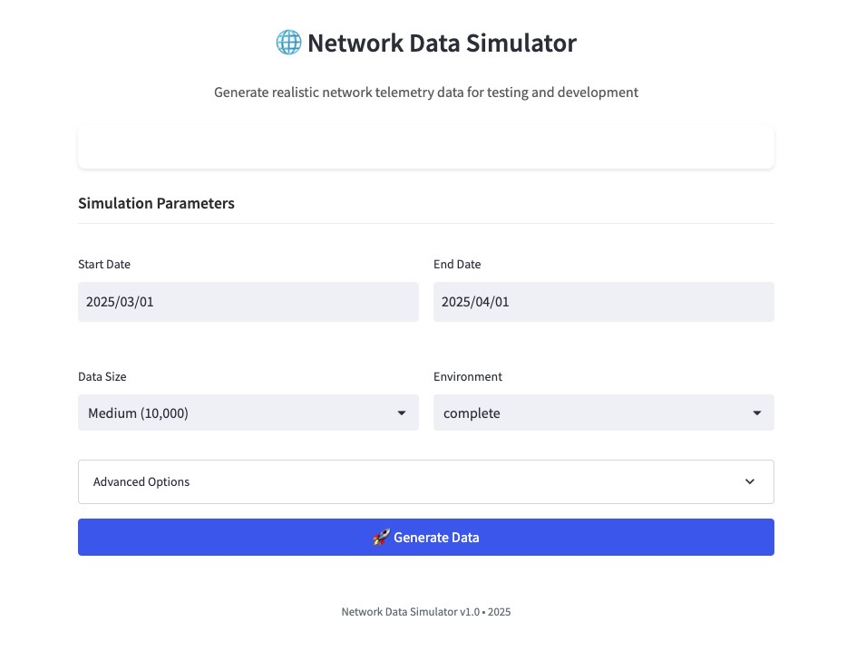
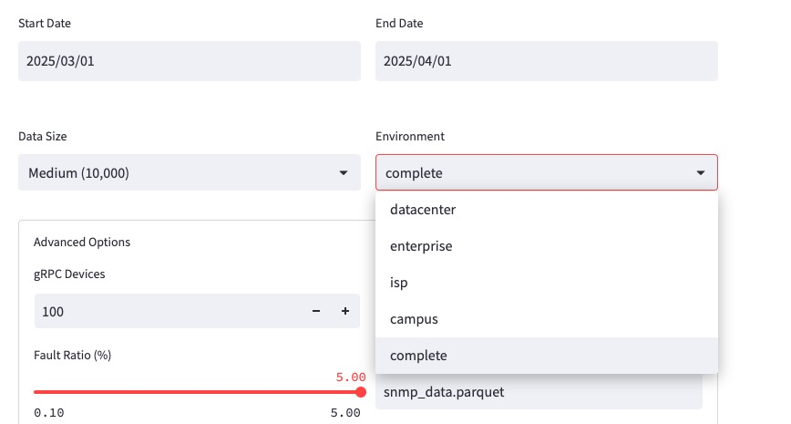
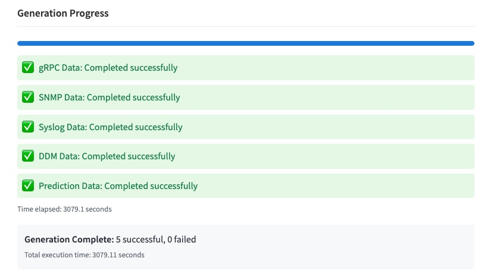
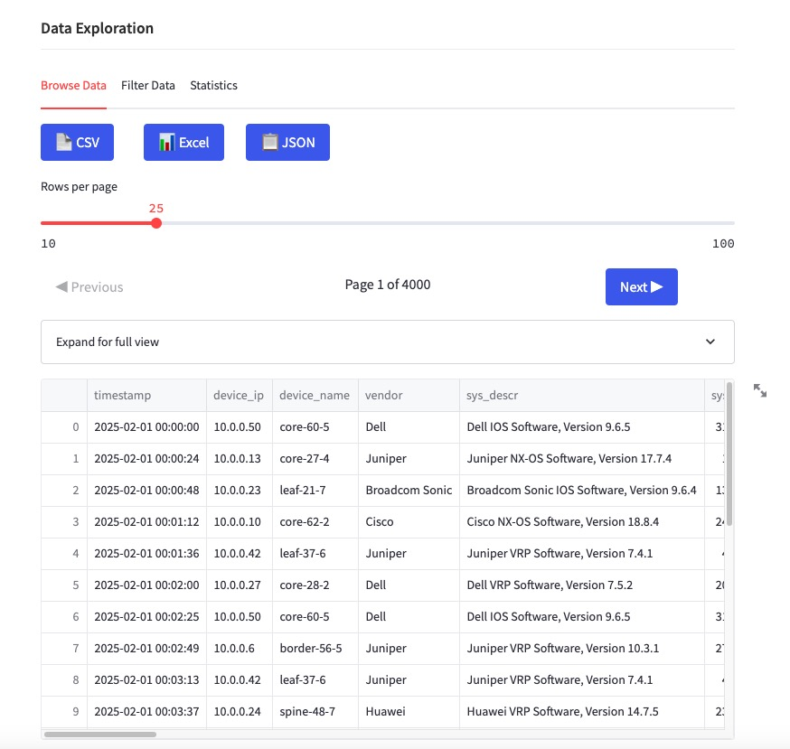
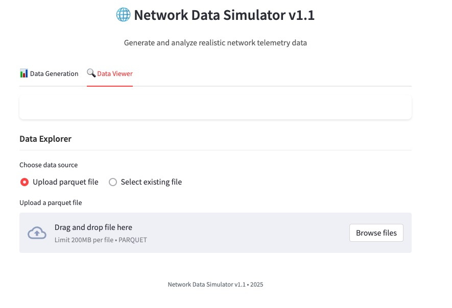

# Network Data Simulator

A comprehensive tool for generating realistic network telemetry data for testing and development.

## 🌟 Features

- **Multi-format Data Generation**: Create gRPC/gNMI, SNMP, Syslog, DDM (optical), and Lifecycle prediction data
- **Customizable Parameters**: Control data volume, time ranges, network environments, and more
- **Realistic Data**: Simulates real-world network devices, vendors, and telemetry formats
- **Modern UI**: Clean, intuitive interface with real-time progress tracking

## 📊 Data Types

The simulator generates these types of network telemetry data:

1. **gRPC/gNMI Data**: Streaming telemetry from modern network devices with vendor-specific paths and formats
2. **SNMP Data**: Traditional monitoring data with MIBs, OIDs, and interface statistics
3. **Syslog Messages**: System and network event logs with proper severity and facility codes
4. **DDM Optical Data**: Digital Diagnostic Monitoring data for optical interfaces
5. **Lifecycle Prediction**: Predictive maintenance data for network hardware

## 🚀 Getting Started

### Prerequisites

- Python 3.7 or higher
- Required packages:
  ```
  pip install streamlit pandas plotly pyarrow
  ```

### Running the Simulator

1. Clone this repository
2. Navigate to the project directory
3. Run the UI:
   ```
   streamlit run simulation_ui.py
   ```
4. Open your browser to the URL shown in the terminal (typically http://localhost:8501)

## 📝 Usage

1. Set your desired parameters:
   - Choose date range for the data
   - Select data volume (from 1,000 to 1,000,000 records)
   - Pick a network environment type
   
2. Advanced options:
   - Configure the number of devices
   - Set fault ratio for simulations
   - Customize output filenames

3. Click "Generate Data" and monitor progress in real-time

## 📋 Output Format

All data is saved in Parquet format for efficient storage and fast loading. Files include:

- `grpc_data.parquet`: gRPC/gNMI subscription data
- `snmp_data.parquet`: SNMP polling data
- `syslog_data.parquet`: System and network events
- `ddm_data.parquet`: Optical interface metrics
- `predict_data.parquet`: Device lifecycle predictions

## 📸 Screenshots

Main interface with simulation parameters



Support Choosing different Scenarios



Super slow speed when generating 1M data



View Parqued online



Upload Files



## 📄 License

This project is licensed under the MIT License - see the LICENSE file for details.

## 🙏 Acknowledgments

- Built with Streamlit for a responsive UI
- Uses Pandas and PyArrow for efficient data handling 
